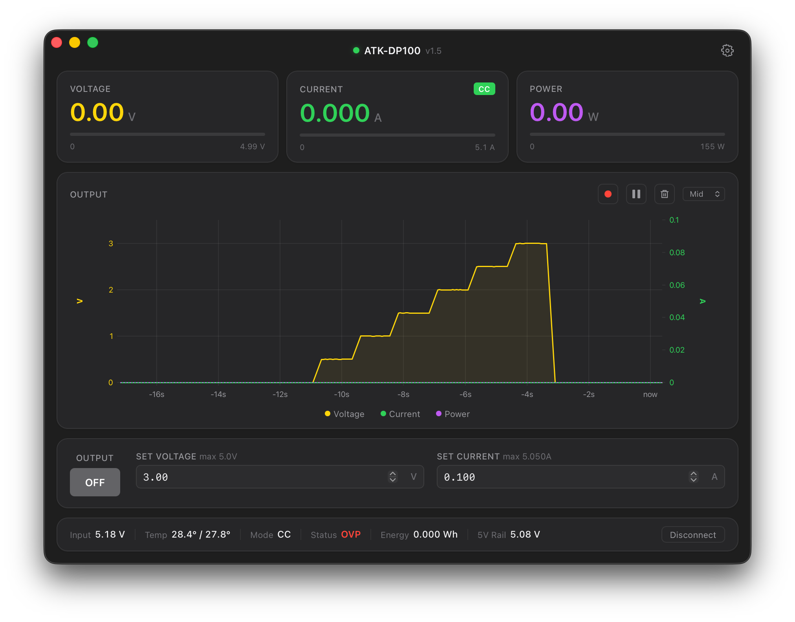

# DP100 Lab

Native macOS app for the **Alientek DP100** digital power supply. Replaces the Windows-only official software with a modern, fast, and beautiful interface built for macOS.



## Features

- **Real-time monitoring** — Voltage, current, power, temperature at 20Hz
- **Live chart** — V/I/P traces with pause, hover tooltips, series toggle, speed control
- **Output control** — ON/OFF, set voltage/current with validation
- **10 presets** (P0-P9) — View, edit, save to device, activate
- **System settings** — OPP, OTP, backlight, volume, reverse protection, auto-output
- **CSV data logging** — Record telemetry to disk with millisecond timestamps
- **Voltage/Current scanning** — Automated sweep with configurable range and step
- **Protocol debug logging** — Full TX/RX packet log for troubleshooting
- **macOS native** — Vibrancy, overlay titlebar, dark/light mode, SF Pro font

## Requirements

- macOS 12+ (Apple Silicon)
- Alientek DP100 connected via USB-A (slave mode)

## Install

Download the latest `.dmg` from [Releases](../../releases).

> **Note:** The app is not signed with an Apple Developer certificate. After installing, run:
> ```bash
> xattr -cr "/Applications/DP100 Lab.app"
> ```
> This removes the macOS quarantine flag. Alternatively, right-click the app → Open → Open.

Or build from source:

```bash
# Prerequisites
curl --proto '=https' --tlsv1.2 -sSf https://sh.rustup.rs | sh
curl -fsSL https://bun.sh/install | bash

# Build
git clone https://github.com/aIeXoid/DP100-Lab.git
cd DP100-Lab
bun install
bun run tauri build
```

The `.app` bundle will be in `src-tauri/target/release/bundle/macos/`.

## Development

```bash
bun install
bun run tauri dev
```

## Architecture

```
dp100-lab/
├── src/                    # Frontend (Svelte 5 + TypeScript)
│   ├── lib/
│   │   ├── components/     # MetricCard, RealtimeChart, SettingsSheet
│   │   └── stores/         # Device state, telemetry, presets
│   └── routes/             # Main dashboard page
├── src-tauri/
│   ├── src/                # Backend (Rust + Tauri v2)
│   │   ├── device.rs       # Device communication, polling, commands
│   │   └── lib.rs          # Tauri command handlers
│   └── dp100_proto/        # USB HID protocol library
│       └── src/lib.rs      # CRC-16, framing, all device operations
└── .github/workflows/      # CI/CD (build + release)
```

### Protocol

Custom USB HID protocol library (`dp100_proto`) built from scratch through hardware testing and manufacturer DLL analysis. Key discoveries:

| Flag | Operation |
|------|-----------|
| `0x20` | Apply to output (immediate) |
| `0x40` | Save to preset storage (flash) |
| `0x80` | Activate preset (switch) |
| `0x40` opcode len=0 | Read system settings |
| `0x40` opcode len=8 | Write system settings |

## Support

If this tool saves you time, consider buying me a coffee:

[](https://buymeacoffee.com/aleXoid)

## License

MIT
